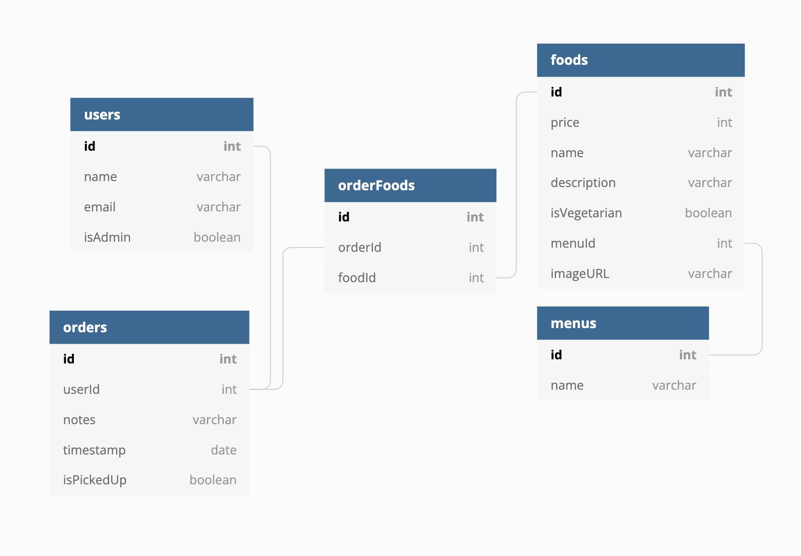

# SnackOverflow


SnackOverflow is a local restaurant that caters lunch for techies. Currently customers must call the restaurant to place a take-out order. To better serve the customers, the owner Bryan 👋 would like to accept online orders. 

##

1. To improve the customer experience, Bryan would like for the menu items to be displayed on the page based on menu category.
1. Each menu item should have an order button and quantity.
1. Vegetarian menu items should display the `icon-veg.png`
1. Menu items within a category should display ascending by price.
1. Customers must register and login to place an order. 
1. Once a user logs in, they should see their name with a welcome message.
1. Currently Bryan is the only user and the only admin. When he logs in he should have an option to view all orders.
1. Customers should be able to view their current order and past orders.
1. Customers will only have one current order. All other orders are in the past and should be marked `picked up`
1. Customers should be able to mark an order as `picked up`
1. An order consists of multiple menu items.
1. An order should have a date attached.
1. An order should have a notes field
1. A customer can have multiple quantities of a menu item in one order.
1. When viewing an order, it should display how many for each item ordered. 
1. When viewing a current order or past order, there should be a total price displayed. 
1. Once an order has been `picked up`, no changes can be made to the order. Prior to `picked up` items may be added or deleted.
1. A complete order may be deleted prior to `picked up`


# Setup and Run Instructions
1. clone the project
1. `cd` into the project and run `npm install`


1. This project uses `json-server`
1. Start `json-server` in the API directory

```
json-server -p 8088 -w  database.json
```


5. To serve this project run
```
serve
```

6. This project uses Bootstrap. You may use anything associated with Bootstrap. https://getbootstrap.com/docs/5.0/getting-started/introduction/
7. Optional - If you want to make changes to the main `SCSS` file, you will need to re-compile the css. Refer to SASS documentation.


# Expectations
It is your job to complete as many features as possible. Bryan with SnackOverflow only has enough money to pay developers for **one day**. You should not refactor any functional code or make unnecessary changes to the styling. Do not deviate from the work listed.

* Be sure to share code solutions with your team. 
* Make branches for features
* Add and commit often
* Employ good software development practices including PRs with teammates approval prior to merging.
* Add your team to the `README.md`

There may be some setting files in this project you have never seen before. Don't get hung up on them. You can come back and review them at a later time.

# ERD
